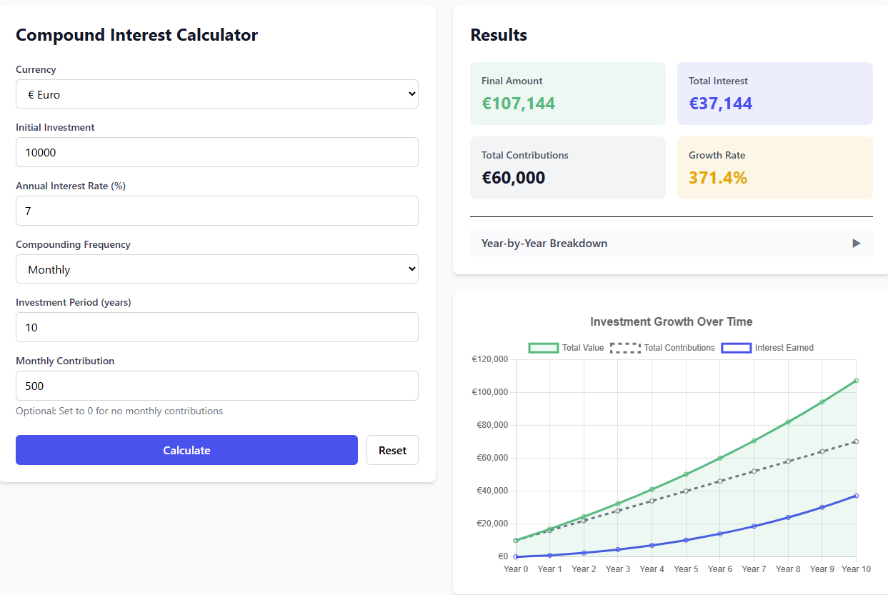

<picture>
  
  
</picture>

# Compound Interest Calculator

A modern, open-source compound interest calculator built with React, TypeScript, and Vite. Calculate investment growth with support for multiple compounding frequencies, recurring contributions, and 6 currencies.

**[Live Demo](https://wealthyparrot.github.io/compound-interest-calculator/)** | **[Wealthy Parrot Blog](https://www.wealthyparrot.com/)**



## Features

- **Multiple Compounding Frequencies:** Annually, semi-annually, quarterly, monthly, or daily
- **Monthly Contributions:** Model recurring investments over time
- **Multi-Currency Support:** EUR, USD, GBP, SEK, NOK, DKK
- **Visual Growth Charts:** Interactive Chart.js visualizations
- **Year-by-Year Breakdown:** Detailed projection table
- **Embeddable:** Use `?embed=true` for iframe integration
- **Responsive Design:** Mobile-first, works on all devices
- **Type-Safe:** Written in TypeScript with full type coverage
- **Tested:** Unit tests for calculation accuracy

## Quick Start

### Try It Online

Visit the [live calculator](https://wealthyparrot.github.io/compound-interest-calculator/) to start calculating immediately.

### Embed in Your Website

Add this iframe to any webpage:

```html
<iframe
  src="https://wealthyparrot.github.io/compound-interest-calculator/?embed=true"
  width="100%"
  height="800"
  frameborder="0"
  title="Compound Interest Calculator">
</iframe>
```

## Installation for Contributors

```bash
# Clone the repository
git clone https://github.com/wealthyparrot/compound-interest-calculator.git
cd compound-interest-calculator

# Install dependencies
npm install

# Start development server
npm run dev

# Run tests
npm test

# Build for production
npm run build
```

## How It Works

### Compound Interest Formula

The calculator uses the standard compound interest formula with support for periodic contributions:

**For principal only:**
```
A = P(1 + r/n)^(nt)
```

**For recurring contributions:**
```
FV = PMT × [((1 + r/n)^(nt) - 1) / (r/n)]
```

Where:
- `A` = Final amount
- `P` = Principal (initial investment)
- `r` = Annual interest rate (as decimal)
- `n` = Compounding frequency (times per year)
- `t` = Time (years)
- `PMT` = Monthly contribution amount
- `FV` = Future value of contributions

### Calculation Methodology

The calculator:
1. Starts with your initial investment (principal)
2. Adds monthly contributions at the start of each month
3. Applies compound interest according to the selected frequency
4. Tracks cumulative growth year by year
5. Calculates total contributions, interest earned, and growth rate

## Tech Stack

- **React 19** - UI framework
- **TypeScript 5** - Type safety
- **Vite 7** - Build tool and dev server
- **Tailwind CSS 4** - Styling
- **Chart.js 4** - Data visualization
- **Vitest** - Unit testing
- **GitHub Pages** - Free hosting

## Project Structure

```
compound-interest-calculator/
├── src/
│   ├── components/       # React components
│   │   ├── CalculatorForm.tsx
│   │   ├── ResultsDisplay.tsx
│   │   ├── Chart.tsx
│   │   └── CurrencySelector.tsx
│   ├── hooks/           # Custom React hooks
│   │   └── useEmbedMode.ts
│   ├── types/           # TypeScript type definitions
│   │   ├── calculator.ts
│   │   └── currency.ts
│   ├── utils/           # Pure utility functions
│   │   ├── compound-calculations.ts
│   │   └── formatting.ts
│   ├── App.tsx          # Root component
│   └── main.tsx         # Entry point
├── tests/               # Unit tests
├── tailwind.config.js   # Tailwind configuration
└── vite.config.ts       # Vite configuration
```

## Contributing

Contributions are welcome! Here's how:

1. Fork the repository
2. Create a feature branch: `git checkout -b feature/my-feature`
3. Make your changes and add tests
4. Ensure tests pass: `npm test`
5. Commit using conventional commits: `git commit -m "feat: add new feature"`
6. Push to your fork: `git push origin feature/my-feature`
7. Open a pull request

## License

MIT License - see [LICENSE](LICENSE) file for details.

## Support

If you find this calculator useful:

- **Star this repository** to help others discover it
- **Share it** on social media or personal finance communities
- **Support the developer** on [Ko-fi](https://ko-fi.com/wealthyparrot)

## Related Projects

- [FIRE Calculator](https://github.com/wealthyparrot/fire-calculator) - Calculate your Financial Independence / Retire Early number

## About

Built by [Wealthy Parrot](https://www.wealthyparrot.com/) - Anti-guru, data-driven personal finance from a European perspective.

Part of the Wealthy Parrot digital products ecosystem focused on making sophisticated financial tools accessible to smart beginners.
